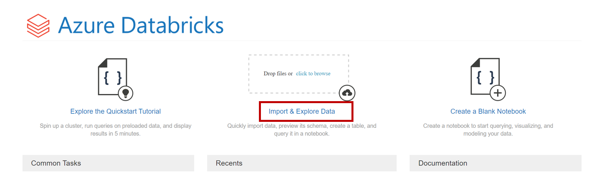

In this lab you will use a built-in quickstart from Azure Databricks to connect to your Blob storage, and you will use a Microsoft Tutorial as guidelines to write data to your SQL Database.

## Prerequisites
If you don't have an Azure Databricks Workspace yet, you can follow [these instructions](https://docs.microsoft.com/en-us/azure/databricks/scenarios/quickstart-create-databricks-workspace-portal?tabs=azure-portal) to create one using using the [Azure Portal](https://portal.azure.com).

Besides that, you need to make sure that you have Azure Blob Storage so that you can mount files to your Azure Databricks Workspace. If you don't know how to create a Storage Account, please follow [these instructions](https://docs.microsoft.com/en-us/azure/storage/common/storage-account-create?tabs=azure-portal).

Please upload the [preferences.json](https://github.com/machteldbogels/handsonlabs/blob/master/etlwithdatabricks/preferences.json) file to your Storage Account following [these instructions](https://docs.microsoft.com/en-us/azure/storage/blobs/storage-quickstart-blobs-portal). 

As a final prerequisite, make sure that you have a SQL Database instance. If you don't have it yet, you can follow [these instructions](https://docs.microsoft.com/en-us/azure/azure-sql/database/single-database-create-quickstart?tabs=azure-portal) to deploy it.

## The Lab
Go to your Databricks resource and select `Launch Workspace` to go to your Databricks Workspace. In the Overview pane of your Databricks Workspace, select the `Import & Explore Data` option in the middle of the page.

Then select the `Other Data Sources` tab, and press `Create Table in Notebook`. 

This will automatically prepopulate a notebook with which you can connect to an Azure Blob Storage.

