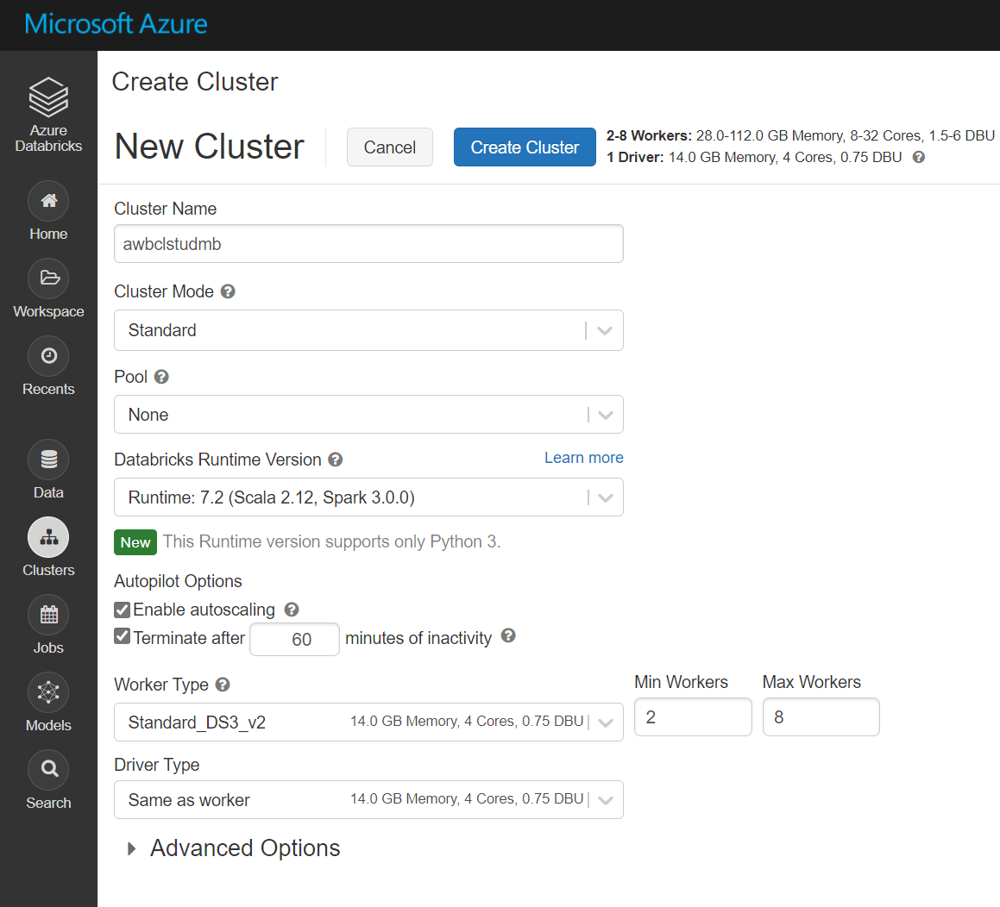

## Exercise 1: Work with Azure Databricks

### Task 1: Create and configure an Azure Databricks instance.

1. In the Azure portal, at the top left of the screen, click on the **Home** hyperlink.

1. In the Azure portal, click on the **+ Create a resource** icon.

1. In the New screen, click in the **Search the Marketplace** text box, and type the word **databricks**. Click **Azure Databricks** in the list that appears.

1. In the **Azure Databricks** blade, click **Create**.

1. In the **Azure Databricks Service** blade, create an Azure Databricks Workspace with the following settings:

    - **Workspace name**: **awdbwsstudxx**, where **xx** are your initials.

    - **Subscription**: the name of the subscription you are using in this lab

    - **Resource group**: the name of the resource group you are using in this lab

    - **Location**: the name of the Azure region which is closest to the lab location and where you can provision Azure VMs.

    - **Pricing Tier**: **Premium (+ Role-based access controls)**.

    - **Deploy Azure Databricks workspace in your Virtual Network**: **No**.

        

1. In the **Azure Databricks Service** blade, click **Create**.

   > **Note**: The provision will take approximately 3 minutes. The Databricks Runtime is built on top of Apache Spark and is natively built for the Azure cloud. Azure Databricks completely abstracts out the infrastructure complexity and the need for specialized expertise to set up and configure your data infrastructure. For data engineers, who care about the performance of production jobs, Azure Databricks provides a Spark engine that is faster and performant through various optimizations at the I/O layer and processing layer (Databricks I/O).
   
### Task 2: Open Azure Databricks.

1. Confirm that the Azure Databricks service has been created. 

1. If you are still in the same window, simply press **Go to resource** or otherwise navigate to the **Resource group** in which your Databricks Workspace is deployed and then click **awdbwsstudxx**, where **xx** are your initials to open Azure Databricks. This will open your Azure Databricks service.

    

### Task 3: Launch a Databricks Workspace and create a Spark Cluster.

1. In the **awdbwsstudxx** screen, click on the button **Launch Workspace**.

    > **Note**: You will be signed into the Azure Databricks Workspace in a separate tab in your browser.

1. Under **Common Tasks**, click **New Cluster**.

1. In the **Create Cluster** screen, under New Cluster, create a Databricks Cluster with the following settings, and then click on **Create Cluster**:

    - **Cluster name**: **awdbclstudxx**, where **xx** are your initials.

    - **Cluster Mode**: **Standard**

    - **Pool**: **None**

    - **Databricks Runtime Version**: **Runtime: 7.2 (Scala 2.12, Spark 3.0.0)**

    - Make sure you select the **Terminate after 60** minutes of inactivity check box. If the cluster isn't being used, provide a duration (in minutes) to terminate the cluster.

    - Leave all the remaining options to their current settings.

        

1. In the **Create Cluster** screen, click on **Create Cluster** and leave the browser tab open.

> **Note**: The creation of the Azure Databricks instance will take approximately 10 minutes as the creation of a Spark cluster is simplified through the graphical user interface. You will note that the **State** of **Pending** whilst the cluster is being created. This will change to **Running** when the Cluster is created.


## Exercise 2: Performing ETL using Scala or Python

**Basic transformations**

1. Within the Workspace, using the command bar on the left, select **Workspace**, **Users**, and select **your username** (the entry with house icon).

1. In the blade that appears, select the **downwards pointing chevron next to your name**, and select **Import**.

1. On the Import Notebooks dialog, select **URL below** and paste in the following URL: 

```url
    https://github.com/MicrosoftDocs/mslearn-perform-basic-data-transformation-in-azure-databricks/blob/master/DBC/05.1-Basic-ETL.dbc?raw=true
```

1. Select **Import**.

1. A folder named **05.1-Basic-ETL** after the import should appear. Select that folder.

1. The folder will contain one or more notebooks that you can use to learn basic transformations using **scala** or **python**.

Follow the instructions within the notebook, until you've completed the entire notebook. Then continue with the remaining notebooks in order:

- **01-Course-Overview-and-Setup** - This notebook gets you started with your Databricks workspace.
- **02-ETL-Process-Overview** - This notebook contains exercises to help you query, large data files and visualize your results.
- **03-Connecting-to-Azure-Blob-Storage** - You perform basic aggregation and Joins in this notebook.
- **04-Connecting-to-JDBC** - This notebook lists the steps for accessing data from various sources using Databricks.
- **05-Applying-Schemas-to-JSON** - In this notebook you learn how to query JSON & Hierarchical Data with DataFrames
- **06-Corrupt-Record-Handling** - This notebook lists the exercises that help you understand how to create ADLS and use Databricks DataFrames to query and analyze this data.
- **07-Loading-Data-and-Productionalizing** - Here you use Databricks to query and analyze data stores in Azure Data Lake Storage Gen2.
- **Parsing-Nested-Data** - This notebook is located in the Optional subfolder, and includes a sample project for you explore later on in your own time.

>[Note] You'll find corresponding notebooks within the Solutions subfolder. These contain completed cells for exercises that ask you to complete one or more challenges. Refer to these if you get stuck or simply want to see the solution.

**Advanced transformations**

1. Within the Workspace, using the command bar on the left, select **Workspace**, **Users**, and select **your username** (the entry with house icon).

1. In the blade that appears, select the **downwards pointing chevron next to your name**, and select **Import**.

1. On the Import Notebooks dialog, select **URL below** and paste in the following URL: 

```url
    https://github.com/MicrosoftDocs/mslearn-perform-advanced-data-transformation-in-azure-databricks/blob/master/DBC/05.2-Advanced-ETL.dbc?raw=true
```

1. Select **Import**.

1. A folder named **05.2-Advanced-ETL** after the import should appear. Select that folder.

1. The folder will contain one or more notebooks that you can use to learn basic transformations using **scala** or **python**.

Follow the instructions within the notebook, until you've completed the entire notebook. Then continue with the remaining notebooks in order:

- **01-Course-Overview-and-Setup** - This notebook gets you started with your Databricks workspace.
- **02-Common-Transformations** - In this notebook you perform some common data transformation using Spark built-in functions.
- **03-User-Defined-Functions** - In this notebook you perform custom transformation using user-defined functions.
- **04-Advanced-UDFs** - In this notebook you use advanced user-defined functions to perform some complex data transformations.
- **05-Joins-and-Lookup-Tables** - In this notebook you learn how to use standard and broadcast join for tables.
- **06-Database-Writes** - This notebook contains exercises to write data to a number of target databases in parallel, storing the transformed data from your ETL job.
- **07-Table-Management** - Here you handle managed and unmanaged tables to optimize your data storage.
- **Custom-Transformations** - This notebook is located in the Optional subfolder, and includes a sample project for you to explore later on in your own time.

>[Note] You'll find corresponding notebooks within the Solutions subfolder. These contain completed cells for exercises that ask you to complete one or more challenges. Refer to these if you get stuck or simply want to see the solution.
